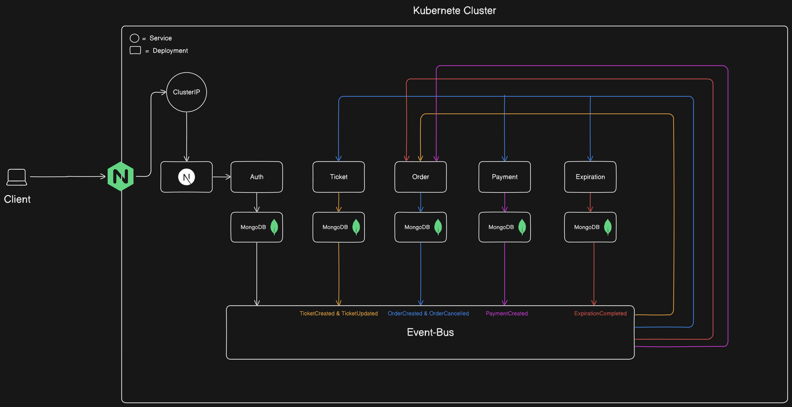

  <h1>
    Ticketing
  </h1>
   
    

      <video src="./client/public/ticketing-video.mp4" alt="Project Banner">
    

   

  

    
    
    
    
    
    
    
    
    
    
  

## 📋 <a name="table">Table of Contents</a>

1. 🤖 [Introduction](#introduction)
2. ⚙️ [Tech Stack](#tech-stack)
3. 💻 [System Design](#system-design)
4. 🔋 [Features](#features)

## <a name="introduction">🤖 Introduction</a>

Welcome to the Ticketing App, a full-stack, microservices-based application designed to simplify event ticketing and enhance user convenience. Built with modern web technologies and powered by Docker and Kubernetes, this platform offers a seamless experience for browsing, ordering, and securely managing tickets. Robust features like Stripe payments, account management, and role-specific access ensure efficiency, scalability, and secure data handling across the entire system.

## <a name="tech-stack">⚙️ Tech Stack</a>

- Next.js
- MongoDB
- Express Js
- Nginx
- Shadcn UI
- TailwindCSS
- React Hook Form
- Zod
- TypeScript
- Docker
- Kubernetes

## <a name="system-design">️💻 System Design</a>

 

## <a name="features">🔋 Features</a>

👉 **View Tickets**: Browse all available tickets for various events.

👉 **Order Tickets**: Select and place orders for desired tickets with ease.

👉 **Lock Tickets**: Securely lock tickets once they are ordered to prevent double-booking.

👉 **Payments with Stripe**: Make secure and reliable payments for your orders using Stripe integration.

👉 **Account Management**: Sign up or log in to manage your account and view your order history.Browse all available tickets for various events.

👉 **Create Tickets**: User can create and list tickets for upcoming events.

👉 **View Orders**: Users can view the status of their orders—whether canceled or completed—and manage them efficiently.

👉 **Concurrency Control**: Ensure data consistency and prevent conflicts during simultaneous ticket purchases or updates.

👉 **Guaranteed Event Delivery**: Leverage an event bus to ensure reliable and consistent delivery of events across the system.

👉 **Microservices Architecture**: Each service operates independently with its own MongoDB database, ensuring scalability, fault tolerance, and clear service boundaries.

## 

